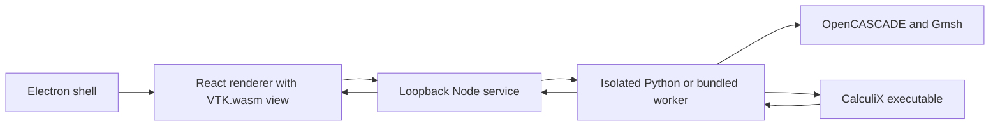

# Sprung FEA implementation

Version 0.1.0 · 2 October 2026 · implementation baseline: `738bb11`

This document describes the implemented application, its numerical and persistence contracts, and the work needed to extend it. Future work is identified separately from shipped behavior. Interaction research is recorded in [interaction-design.md](docs/interaction-design.md); measured acceptance results are recorded in [validation.md](docs/validation.md).

## 1. Scope and product decisions

Sprung FEA analyzes a STEP part or bonded assembly with CalculiX: linear static stress, natural frequencies, linear buckling, steady heat transfer, thermal stress, and harmonic response. The current packaged application targets macOS Apple Silicon. Electron, Vite, React, and VTK compiled to WebAssembly (VTK.wasm) provide the desktop shell and interface; Gmsh with OpenCASCADE imports CAD geometry and creates the volume mesh.

The application follows engineering intent: import a part, choose its material, define where it is held, apply loads, inspect the mesh, and examine results. A study tree with the part's face list on the left, the model view in the center, and an inspector on the right keep these dependencies visible. A collapsible console under the view holds job output and solver checks. Light and dark themes follow the system setting until the user picks one. Basic controls use physical descriptions; advanced controls expose material properties, global support directions, and mesh size.

Official SolidWorks documentation informed the workflow decisions before the interface was implemented. Sprung FEA uses an original layout, styling, assets, and integration code.

Implemented analysis inputs are:

- One solid imported from `.step` or `.stp`, with dimensions and CAD surfaces available for inspection.
- A homogeneous isotropic elastic material, including density and optional yield strength.
- Fixed supports, supports that block selected global X/Y/Z translations, frictionless supports that block only the face normal, and cylindrical supports that block radial, tangential or axial motion of holes and shafts.
- A total vector force distributed over selected faces, normal pressure, gravity, a remote force acting at a point off the faces, a moment, a bearing load on cylindrical faces, and rotation about an axis.
- Point masses: a rigid mass at a center of mass, carried by selected faces, standing in for components that are not modeled.
- Curvature-aware quadratic tetrahedral meshing, with detail presets and an explicit target size.

Results include von Mises stress, maximum and minimum principal stress, maximum shear stress (Tresca, (σ1 − σ3)/2), equivalent and principal strain, displacement magnitude, yield margin, support reactions, force balance, interpolated and nodal probes, section planes with the force and moment they carry, iso-surfaces, thresholds, and a finer-mesh comparison. All numerical results come from the actual solver pipeline.

The GitHub **Build** workflow runs on pull request updates and manual requests only. Branch and tag pushes do not start builds. To build a release, request the workflow with the release tag as its ref (for example, `gh workflow run build.yml --ref v0.2.2`).

## 2. Architecture and source ownership



| Location | Responsibility |
|---|---|
| [src/App.tsx](src/App.tsx) | Application state, job polling, autosave, project save/open, exports, and layout |
| [src/logic.ts](src/logic.ts) | Pure study logic: undo/redo history, draft previews, saved-result validation, yield-margin scale, and material edits |
| [src/Sidebar.tsx](src/Sidebar.tsx), [src/Inspector.tsx](src/Inspector.tsx), [src/Console.tsx](src/Console.tsx), [src/StartScreen.tsx](src/StartScreen.tsx) | Study tree and face list, per-section inspector panels, output/checks console and job progress, and start screen |
| [src/Viewer.tsx](src/Viewer.tsx), [src/scene.ts](src/scene.ts) | VTK.wasm view: CAD-face rendering, selection and hover, camera controls, condition annotations, mesh display, contours, deformation, picking, probes, sections, iso-surfaces, and thresholds |
| [src/viewData.ts](src/viewData.ts) | Decoding of the engine's binary view file, setup triangulation, derived fields, probes at nodes, and surface CSV |
| [src/types.ts](src/types.ts) | Renderer domain types, material presets, and initial study values |
| [src/api.ts](src/api.ts) | Local HTTP requests and browser/native file-save bridge |
| [electron/main.cjs](electron/main.cjs) | Window lifecycle, local service startup, packaged engine paths, application menus, and native save dialogs |
| [electron/preload.cjs](electron/preload.cjs) | Minimal bridge for platform information and file saving |
| [server/index.mjs](server/index.mjs) | File intake, document storage, worker execution, job lifecycle, project serialization, and artifact downloads |
| [server/validation.mjs](server/validation.mjs) | Incoming study schema and value validation |
| [engine/worker.py](engine/worker.py) | Worker entry point: the JSON protocol and command dispatch |
| [engine/cad.py](engine/cad.py) | STEP import, mesh generation, CAD face mappings, and the binary view file |
| [engine/model.py](engine/model.py) | Solver-independent physics: setup validation, rigid-motion check, and equivalent loads (forces, pressures, remote loads, moments, bearing loads, body loads) |
| [engine/calculix.py](engine/calculix.py) | CalculiX adapter: deck syntax, execution and thread control, log checks, and FRD decoding into frames |
| [engine/analyses.py](engine/analyses.py) | Analysis types: each validates a study, writes its solver step, and builds the common result schema |
| [scripts/bundle-runtime.py](scripts/bundle-runtime.py) | Frozen engine generation and relocation of native solver dependencies |
| [scripts/sign-mac.mjs](scripts/sign-mac.mjs) | Ad-hoc application signing and signature verification |

The study model avoids CalculiX deck syntax. The engine keeps three boundaries: `model.py` turns a study into solver-independent quantities (validated supports, equivalent nodal forces, element-face pressures, body accelerations); `calculix.py` is the only module that knows deck syntax, solver execution and output formats; and `analyses.py` registers analysis types, each with `validate`, `deck` and `results`. Adding a solver means another adapter with the same three duties; adding an analysis type means another registry entry.

## 3. Domain and units

| Object | Main fields and meaning |
|---|---|
| Geometry | STEP content hash, bounds, dimensions, volume, recommended element size, preview nodes, and CAD faces |
| Face | CAD entity ID, surface type, area, center, surface anchor, normal, and rendering triangle indices |
| Material | Name, elastic modulus, Poisson ratio, density, and optional yield strength |
| Support | Stable condition ID, name, selected face IDs, and three blocked/free translation flags |
| Point mass | Stable condition ID, name, selected face IDs, mass (kg), and center of mass (mm) |
| Load | Stable condition ID, name, kind, selected faces, vector components, and pressure magnitude |
| Study | Analysis type, material and per-body materials, supports, loads, point masses, thermal conditions, mesh size, detail preset, and equation solver |
| Mesh | Nodes, quadratic tetrahedra, CAD face-to-node/triangle mappings, element count, size, and minimum quality |
| Result | Schema version, analysis type, frames, nodal fields per frame, analysis summary, check rows, charts, warnings, and solver/mesh metadata |

Studies, results, the engine and the view file always use the SI working units. The interface shows either SI or US units, a per-computer preference switched from the status bar and kept in browser storage (`sprung-fea-units`). US units are inches, pounds-force, psi, lb/in³, lb, °F, in/s², lbf·in, Btu/(hr·ft·°F), µin/(in·°F), Btu/(hr·ft²·°F) and Btu/(hr·ft²); hertz, rpm, watts, percentages and ratios are shared. [src/units.ts](src/units.ts) maps each SI working unit to its US unit (temperatures with an offset). Number fields convert what they show and read back, keep the typed text while it is edited, and show converted values to six significant digits; engine check rows, key results and charts convert by their unit strings, and the surface CSV follows the chosen system, with the unit in each column name. In SI the interface uses **mm, N, and MPa**. Material density is entered in **kg/m³**, and gravity in **m/s²**. The solver deck uses the consistent **mm–N–tonne–s** system: density is multiplied by `1e-12`, and acceleration by `1000`.

Face selections reference CAD entities rather than rendering triangles or mesh nodes. Face IDs survive remeshing of the same STEP source. They are scoped to that source's SHA-256 hash; selection transfer to a revised CAD file is not implemented.

## 4. Analysis pipeline

### STEP import

The service stores the uploaded STEP in a document directory and launches an import worker. OpenCASCADE converts STEP length units to millimetres. The worker requires exactly one solid with positive volume, creates a triangulated surface preview for setup, and records dimensions, volume, face metadata, and the source hash. The preview uses its own sizing, independent of the analysis mesh: about 36 segments per full turn on curved faces, element sizes between 1/300 and 1/50 of the longest dimension, and coarser triangles on flat faces. The sample parts produce roughly 3,000–60,000 display triangles.

Surface annotations use anchors on the actual CAD surfaces, including curved faces. The initial mesh recommendation is the larger of the smallest part dimension divided by 2.5 and the largest dimension divided by 60. This is a starting heuristic, not a convergence criterion.

### Bonded assemblies

A STEP file with several solids is an assembly. OpenCASCADE `fragment` makes bodies that touch share their contact faces, so the mesh is continuous across them: they are bonded, with no sliding or separation. Bodies that only partly touch are bonded over the shared area (the footprint is imprinted on the larger face). Overlapping bodies are rejected. A single solid skips fragmenting, which keeps its face numbers. Bonded contact faces are inside the assembly: they are not listed or selectable. Each outer face records its body.

Geometry lists the bodies (name, volume), the groups of bonded bodies, and the interfaces: each face two bodies share, with its bodies, area and center. Each group must be held on its own: the rigid-motion check runs per group and names the bodies that can still move. A vibration study counts rigid motions over all groups. Bodies may have their own material (`bodyMaterials`, by body id); the others use the part material. The deck writes one element set, material and section per material group, and body loads and the mass check use each element's density. The suggested element size uses the thinnest body's smallest extent. Region refinement is not available for assemblies yet.

### Contact and bolts

A static study of an assembly can turn on contact (`contact: true`), which the interface keeps hidden until then. Touching body pairs (the interfaces grouped by body pair, ids such as `"1-2"`) stay bonded unless `contacts` sets them `frictional` (with `friction`, default 0.2) or `frictionless`. Other analyses ignore contact.

A contact gives the interface's nodes a copy for one side. At each node, bodies stay joined only through interfaces that remain bonded (a union over bodies per node), so a node on both a bonded and a separated interface splits correctly. Elements, outer faces and the viewer's surface triangles of each side use its own nodes; the view file carries the copies. Each pair becomes face-to-face penalty contact (`TYPE=SURFACE TO SURFACE`) between the two sides' element faces, with its own `*SURFACE INTERACTION`: a linear pressure–overclosure slope K = 20 × E / h (the softer body's modulus, the element size; `contactStiffness` multiplies it), so surfaces pressed at p overlap by about p / (20 E) of an element; and for friction, a stick slope of K / 100, as the CalculiX manual advises. Two choices came from trials on a bolted joint. Mortar contact was 4–8 times slower on stacked blocks and did not finish the joint, so penalty contact is used. Faces that start exactly touching flip between active and inactive at round-off, which CalculiX's default contact convergence test (0.1% change in contact elements) never accepts; `*CONTROLS, PARAMETERS=CONTACT` relaxes it to 5%. Bodies held only by contact have no stiffness until contact closes, so the first iteration is singular: weak springs (`SPRING2`, 1e-8 E h each) join every node and its copy across each contact. Springs to ground were tried first and carried 10% of a load, resisting the assembly's legitimate deflection; across the interface they resist only relative motion. Their total force is reported, with a warning above 1% of the loads.

Assemblies hide interior faces behind other bodies. The face list groups faces by body, with show/hide, isolate, and (while a condition is edited) all faces of the body; a right-click on a face in the view offers the same for its body. Hidden bodies are left out of the drawn surface, picking, annotations and, through each tetrahedron's body (`tetBodies` in the view file), sections and filters, in setup and results alike. Faces two bodies share are drawn once per side (`triangleBodies` gives each triangle its body and the body behind it), and a side shows only while its body is visible and the other is hidden, so hiding a body never leaves a hole in its neighbor; for contact the two sides have their own nodes, so the slave side shows its contact pressure. The faces being picked, and the hovered one, are also drawn in the overlay layer as a translucent fill and outline, so they show through whatever is in front, and each condition's name is pinned at its first face. Cylindrical faces record their axis and extent at import; a likely bolt is a body's cylindrical face that runs through a coaxial hole in another body, at most 1.5 times as wide or 3 mm wider, and the bolt editor offers these.

A bolt (`bolts`: shank faces and `preload` in N) is cut at meshing time: halfway along its selected cylindrical shank faces, a disk trimmed to the bolt body is fragmented into the model. The cut renumbers the bolt's faces, so every new face is matched to the original it lies on (closest point on a copy of each original face, inside its trimmed area) and the mesh keeps the original face ids; the two halves stay one body. Embedding the disk instead, which would keep ids, failed on the cylinder's seam. The far half's section nodes get copies, tied by `u_far − u_near + n δ = 0` per direction, with δ the first DOF of a reference node; a force there is tension in the bolt. Step 1 tightens: `*CLOAD` of the preload on the reference nodes. Step 2 holds each bolt's length (`*BOUNDARY, FIXED`), replaces that load with the study's loads (`*CLOAD, OP=NEW`), and applies them; with plasticity and unloading a third step removes them. Bolts alone are a valid load. Frames are labelled by phase (Tightening, Load, Unloading) from the step time.

Results add, per bolt, its force tightened and loaded (from `*NODE PRINT` of the reference nodes, which the `.frd` does not carry), a bolt-force chart against load, and per contact the normal and shear force and contact area from CalculiX's own totals (`*CONTACT PRINT` `CF` with `SLAVE`/`MASTER`), the peak pressure at slave nodes, and a state: open (under 1% of the area in contact), stuck, sliding (shear at 98% of the friction limit), or pressed (frictionless). Contact pressure is a plot; the faces it acts on are inside the assembly, so a section shows it. Engine tests on the bolted-joint sample check that the cut keeps face names, that the bolt, head, nut and plates all carry the preload, and that the plates stick at 3 kN and slide at 6 kN with shear at μ times the clamping force, the bolt carrying the rest.

### Meshing

Gmsh imports the same STEP source, applies curvature-aware size controls, generates a tetrahedral volume mesh, raises it to second order, and optimizes the curved elements. The worker accepts ten-node tetrahedra and records quadratic surface triangles for load integration and selection mappings.

Minimum signed element quality must be positive. There is no limit on element count or element size; any positive size is meshed. Practical limits are memory and time: Gmsh and the worker hold the mesh in memory, the direct solver's factorization grows quickly with model size, and the viewer holds the volume mesh in a 32-bit WebAssembly heap (4 GB).

Coarse, Medium, and Fine use target-size multipliers of 1.5, 1, and 0.65 relative to the recommendation. An explicit size selects Custom. A solve generates its mesh automatically; mesh preview is a separate operation.

### Physical validation

Before writing the deck, the worker validates material values, load values, face references, support directions, and nonzero loading. It constructs the six rigid-body motion modes and checks the rank of the constrained degrees of freedom. An incomplete restraint produces an actionable error. The application does not add artificial springs to conceal instability.

### Deck and load construction

Gmsh connectivity is converted to CalculiX C3D10 ordering by exchanging the final two midside nodes. Deck numbers use bounded significant-digit formatting to avoid fixed-width input problems.

Vector force means **one total force across all selected faces**. Seven-point triangle quadrature integrates the quadratic face shape functions and distributes consistent nodal forces, normalized by the combined loaded area. Selecting another face does not multiply the specified total.

Pressure maps each CAD boundary triangle to the appropriate tetrahedron face and writes CalculiX pressure loads. Positive pressure acts into the solid. Overlapping pressure definitions add. Gravity definitions also add and use the material density.

Remote forces and moments are carried by the selected faces as a deformable connection, the distribution of an RBE3 element or distributing coupling, computed in the engine rather than with solver constraints. The force becomes a uniform traction acting at the faces' area centroid C; the moment (including the moment (P − C) × F of a force acting at a remote point P) becomes a traction **a** × (**x** − C) that varies linearly over the faces, with **a** = J⁻¹M and J = ∫(|r|²I − r rᵀ) dA. Integrating these tractions against the quadratic face shape functions gives nodal forces whose resultant force and moment are exactly the specified ones. Faces that cannot resist a moment (J singular) are rejected.

A bearing load presses on the half of the selected cylinder that faces the load. The pressure varies as the cosine of the angle between the surface normal and the load direction, and is scaled so its resultant along the load equals the force. The engine finds the cylinder axis from the surface normals, rejects non-cylindrical faces, and rejects forces with a component along the axis. A bore split into two CAD faces can be selected as one bearing.

A point mass is carried by its faces the same way as a remote force. In a static study it contributes its weight (mass × gravity) and its centrifugal force (mass × ω² × distance from the axis), each acting at its center of mass. Its own rotational inertia is not modeled. The Checks tab reports the mass of the meshed part plus point masses.

Rotation is a centrifugal body load, `*DLOAD CENTRIF` with ω² in rad²/s² about an axis through a point, entered in rpm. Only one rotation per study is allowed. Its equivalent nodal forces use the same four-point tetrahedron rule as CalculiX, so reaction recovery stays exact.

Equivalent applied nodal contributions are retained for force, pressure, and gravity. They are required when interpreting the solver's nodal force output at supported nodes.

### Plasticity

A static study with `plasticity: true` lets the material yield. The hardening curve is bilinear and isotropic (`*PLASTIC`): yield strength at zero plastic strain, rising in a straight line to the ultimate strength at the plastic part of the elongation at break (elongation − ultimate/E), and flat beyond. Materials need yield, ultimate strength (above yield) and elongation at break; the presets include typical values. Points from a tensile test (`hardening`: [total strain %, stress MPa], stress not falling and plastic strain rising) replace the straight line: each becomes a `*PLASTIC` point at plastic strain = strain − stress/E, flat beyond the last; the tear warning then uses the elongation at break if given, else the last point. The load is applied in automatic steps, as for large deformation, and the two combine. With `unload: true` a second step removes every load (`*CLOAD, OP=NEW` and `*DLOAD, OP=NEW`), so the last frame shows the permanent displacement and residual stress; the result opens at full load. Results add equivalent plastic strain (PEEQ, clamped at zero after nodal averaging), the largest plastic strain, and the permanent displacement. It warns when the part does not yield and when plastic strain exceeds the elongation at break. A load beyond the collapse load cannot be applied and reports so. Engine tests check a bar pulled to 1.05 × yield: plastic strain (σ − σy)/H, stretch, and permanent set match to the precision of the `.frd` file.

CalculiX's own messages are streamed through a pipe into `solver.log`: written straight to a file, its final buffered lines, including the error that stopped it, were lost on an error exit.

### Large deformation

A static study with `largeDeformation: true` runs `*STEP, NLGEOM` with automatic load steps (start at 10% of the load, at most 25% per step, at most 200 steps): stiffness follows the deformed shape, so thin strips, clips and springs that bend or twist far are not overpredicted. The material stays linear elastic. Every load step becomes a result frame, shown at full load and true scale by default; a load–displacement chart compares the peak displacement with the straight line through the first step, which is what linear theory would predict. Pressure follows the deformed surface and rotation the deformed shape, so with either of them the force balance check is left out. A linear static study whose movement exceeds 5% of the smallest part dimension suggests turning large deformation on. Steps that cannot converge report that the load could not be applied in small enough steps. Against the Bisshopp–Drucker elastica for a cantilever with PL²/EI = 1, the beam's tip moves within 1% of 0.3017 L down and 0.0566 L inward.

### Natural frequencies

A natural frequency study (`analysis: "frequency"`, `modes`: 1–50, default 6) runs `*FREQUENCY` with the direct solver and ARPACK; the study's equation-solver choice applies to static studies only. Loads are optional. When the study has any, Solve asks whether to include them, and the answer travels with the solve request as `preload` rather than in the study. Included loads need supports that hold the part; a linear `*STATIC` step under them, with no output, precedes `*STEP, PERTURBATION` `*FREQUENCY`, so the modes include the stress stiffness they leave (tension and spin raise frequencies, compression lowers them; a negative eigenvalue means the loads exceed buckling and is reported). Spin softening and gyroscopic effects are not modeled. An engine test checks f² ≈ f₀²(1 − P/Pcr) for an axially loaded cantilever. Supports are optional: the engine counts the rigid motions the supports leave free (the same rank check as static validation) and, for a free or partly held part, requests that many extra modes with a negative shift, since the stiffness matrix is singular. Those first modes are labelled rigid motions at 0 Hz and excluded from key results.

Frequencies come from the `.dat` eigenvalue table; effective modal mass per direction is reported as a fraction of CalculiX's total effective mass, which counts only mass that can move (mass on supported nodes is left out). Each mode shape is scaled to a 1 mm peak displacement and its von Mises stress alike, so modal stress reads in MPa per mm of peak motion; yield margin is not offered. The key result for mesh convergence is the first elastic frequency.

Point masses add inertia through RBE3 constraints: a `MASS` element on an extra node at the center of mass, tied by three `*EQUATION`s to its faces' area-weighted mean translation plus their mean rotation times the offset. At most 60 face nodes take part, thinned by farthest-point sampling with weights gathered to the nearest kept node. CalculiX cannot place mass on an equation's dependent side in an eigenvalue analysis, so each equation eliminates the face-node direction with the largest coefficient that is neither supported nor already eliminated; a mass on fully supported faces is rejected.

The results panel lists modes with frequency and effective mass, and animates the selected mode shape.

### Buckling

A buckling study (`analysis: "buckling"`, `modes` default 3) runs `*BUCKLE` with the study's supports and loads as the reference load. Each factor multiplies all loads together; the first positive factor is the key result. The first `.frd` frame is the reference state, whose peak stress times the first factor is compared with the yield strength: above it, the part yields before it buckles. A first factor below 1 means buckling under the applied loads; negative factors mean buckling with the loads reversed, and a study with only negative factors has no key result. Shapes are scaled to a 1 mm peak and shown still. The panel reminds the user that imperfections and yielding make real buckling loads lower, and recommends a factor of at least 2 to 3.

### Heat transfer and thermal stress

Thermal studies use thermal conditions on faces: a fixed temperature (°C), a total heat flow into the faces (W, spread as a uniform flux over their area), convection (film coefficient in W/(m²·K) with an air or fluid temperature), and radiation (emissivity 0–1 with a surroundings temperature, `*RADIATE` with `*PHYSICAL CONSTANTS`, absolute zero −273.15 °C and σ = 5.670374e-11 N·mm/(s·mm²·K⁴)); heat generation (W) acts evenly through the whole part. A settled (steady) study needs at least one fixed temperature, convection or radiation, or no steady state exists. Where faces with different fixed temperatures meet, the later condition sets the shared edge. The material needs thermal conductivity (W/(m·K), unchanged in the mm–N–s deck), and thermal stress also needs expansion (µm/(m·°C), × 1e-6 in the deck). In deck units 1 W is 1000 N·mm/s, film coefficients are multiplied by 1e-3 and specific heat (J/(kg·K)) by 1e6. A material's temperature table (`byTemperature`) gives elastic modulus, conductivity and expansion at temperatures; a property with values at two or more temperatures is written as a CalculiX table in thermal studies, and every other analysis uses the constants.

With `transient: {on, duration, start}` temperatures are followed over time from a uniform start, every condition switched on at time zero; the material then needs specific heat. CalculiX's automatic incrementation fails on a sudden temperature at time zero, so the duration is split into three stages of fixed increments, finest at the start (to 1%, 10% and 100% of the duration with 25, 25 and 75 increments), and about 50 frames are stored. Results add a chart of the highest and lowest temperature (and, for thermal stress, peak stress) over time whose points pick the frame, open at the end, and warn when temperatures are still changing over the last tenth of the time. Heat balance is not checked over time, since stored heat makes in and out differ. Engine tests check an insulated part warming at P/(mc) and a bar's end against the series solution.

Heat transfer runs `*HEAT TRANSFER, STEADY STATE` with `*BOUNDARY` on degree of freedom 11, `*DFLUX` surface and body flux, and `*FILM`. Results are temperature and heat flux magnitude (W/m²). Thermal stress runs `*COUPLED TEMPERATURE-DISPLACEMENT, STEADY STATE` with the supports, any loads and point masses, `*EXPANSION, ZERO` at the stress-free temperature (default 20 °C), and initial temperatures at that value. Its results add temperature to the static fields and checks.

The heat balance check adds up heat flowing in and out: heat flows and generation, convection integrated from nodal temperatures with the quadratic face shape functions, and the heat supplied at fixed temperatures. CalculiX's `RFL` at those nodes, like force reactions, also contains the share of distributed heat landing on them, which is subtracted. A purely thermal stress study has no applied force, so its force balance compares the reactions with their own size. The `.frd` file stores five significant digits, which bounds the precision of every result read from it.

### Harmonic response

A harmonic response study (`analysis: "harmonic"`) finds how much the part vibrates under sinusoidal excitation across a frequency range (`harmonic.min`, `harmonic.max` in Hz). CalculiX first finds `modes` natural modes (default 20, `*FREQUENCY, STORAGE=YES`), then sums their responses (`*STEADY STATE DYNAMICS`) with the same modal damping ratio in every mode (`harmonic.damping`, default 2% of critical), at frequencies it places between the natural frequencies (3–12 per interval, fewer with many modes). Point masses add inertia as in vibration studies.

The excitation is either the study's loads, each the amplitude of a sinusoidal load, or base shaking: an acceleration in g along X, Y and Z at the supports. Base shaking is solved relative to the base, as the equivalent uniform inertial load −ρa (and −m·a on point masses). CalculiX's own `*BASE MOTION` was not used: its modal damping acts on absolute motion, which corrupted the response well below resonance (the beam's relative tip motion at 20 Hz came out nearly twice the static value).

Results at each frequency are complex. The displacement amplitude is √(|uₓ|² + |u_y|² + |u_z|²) at each node; stress amplitude is the largest von Mises stress over twelve phases of a cycle; the displayed shape is the instant when the most-moving node peaks. Response charts (log scale) plot peak displacement and stress amplitude against frequency; clicking them shows the nearest stored frequency. At most 40 frequencies keep nodal fields: every local maximum, the ends, then evenly spaced points. The study opens at the largest response. It warns when the highest mode found is below 1.5 × the top of the range, and when stress at resonance exceeds yield. Key results are the peak displacement and stress amplitudes.

### Solve and result decoding

CalculiX runs as a native subprocess with no time limit; long jobs can be cancelled. Its complete output streams to `solver.log`, because iterative solves log every iteration. The Output console also receives native Gmsh messages and CalculiX solver stages, increments, and residuals while the job runs. Iterative residual updates are sampled at most twice per second, with the final residual always included. On macOS/Linux a pseudo-terminal keeps CalculiX's C output line buffered; Windows uses a pipe, with Fortran terminal output unbuffered (C messages may arrive in batches). On macOS/Linux Gmsh native stdout is redirected to the worker's stderr progress stream; Windows reports explicit meshing phase messages and leaves native Gmsh terminal output disabled to preserve the JSON protocol across C runtimes. Stdout remains reserved for the final JSON result. The service retains the latest 1,000 timestamped events per job with sequence numbers; the renderer requests events after its cursor and drains the final batch even when the job has already finished. The console keeps the latest 1,000 entries. Gmsh's percentages describe individual meshing phases, not overall job completion, and CalculiX has no universal completion percentage for these analysis types, so the job card keeps an indeterminate bar.

The study chooses direct or iterative, and gets the best solver of that kind on the computer that solves (`calculix.solver_of`), written to the deck as `*STATIC, SOLVER=…`. The interface offers only those two; the service also takes the names of single iterative solvers, which studies saved before 0.3 used and which the interface reads as `iterative`:

| Study value | CalculiX solver | Use |
|---|---|---|
| `direct` (default) | `PARDISO` (Apple Accelerate, or Intel oneMKL in `sprung-solve`) or `SPOOLES` | Direct sparse factorization. Most robust, equilibrium to round-off; memory grows quickly with model size |
| `iterative` | `iterative-amg` where `sprung-solve` has hypre (Linux and Windows), else `iterative-cholesky` (macOS) | The best iterative solver here |
| `iterative-amg` | `PARDISO`, answered by hypre's CG with BoomerAMG in `sprung-solve` | Conjugate gradients with algebraic multigrid, to a relative residual of 10⁻⁸: the direct answer to the digits the results keep. A fraction of the direct solver's memory; faster on large, compact parts |
| `iterative-cholesky` | `ITERATIVE CHOLESKY` | Conjugate gradients with incomplete-Cholesky preconditioning. Much less memory |
| `iterative-scaling` | `ITERATIVE SCALING` | Conjugate gradients with diagonal scaling. Least memory; most iterations |

`GET /api/solvers` reports what each choice gives here (`calculix.solver_options`, from the worker's `solvers` command, asked once per service): the direct and iterative solvers' names, whether the iterative one threads, and CG with BoomerAMG on the GPU, with the GPU's name, where a GPU build of `sprung-solve` works. The Solver section of Mesh + Solver shows Direct and Iterative, then CPU and GPU where there is a GPU, and names the solver the choice runs. Like threads, the hardware is a per-machine preference outside the study, stored by the renderer and sent with each solve (`?device=gpu`, `SPRUNG_FEA_DEVICE`); it applies to the iterative solver only, and the engine falls back to the CPU where the GPU build does not work (`calculix.device`).

The direct solver is the fastest exact one the bundled CalculiX has (`calculix.direct_solver`): PARDISO, then SPOOLES. `scripts/build-solver.py` builds CalculiX 2.23 with both on Apple silicon, Linux x64 and Windows x64, from one conda-forge environment per platform (`native/calculix/solver-env-*.yml`):

- **PARDISO on macOS** is Apple Accelerate. `native/calculix/accelerate_pardiso.c` answers CalculiX's PARDISO calls (the MKL routine `pardiso_`: analyze and factor, solve, release) with Accelerate's sparse solvers: supernodal Cholesky with METIS nested-dissection ordering, LDLT with threshold partial pivoting when Cholesky finds the matrix indefinite (shifted eigenvalue problems, buckling), and LU with threshold partial pivoting for nonsymmetric matrices (frictional contact, coupled temperature–displacement; QR before macOS 15.5). The ordering and symbolic analysis take about half of a factorization and run serially, so they are kept for the last matrix structure: nonlinear steps, which refactor the same structure every iteration, reuse them (the contact, plasticity and large-deformation tests run 1.6 times faster). Accelerate ships with macOS, so nothing is added to the bundle.
- **PARDISO on Windows and Linux** is Intel oneMKL's, run by `sprung-solve`, a separate program. CalculiX is GPL-2.0-only and MKL is proprietary, so MKL is never linked into CalculiX (`THIRD_PARTY_NOTICES.md`). `sprung-solve` (`native/sprung-solve`, MIT) links MKL statically and solves systems sent through its standard input. The protocol (`docs/solver-protocol.md`) uses 0-based compressed sparse rows and 64-bit indices. `native/calculix/pardiso_client.c` is CalculiX's `pardiso_`: on the first call it starts `sprung-solve --serve`, found in `SPRUNG_FEA_SOLVE` or at `sprung-solve/sprung-solve` beside `ccx`, and then sends each factorization and solve through the pipe.
  - **Lifetime.** The helper ends with CalculiX, even mid-factorization: on Linux through the parent-death signal, on Windows through a job object.
  - **Structure reuse.** It keeps PARDISO's analysis while a factorization's structure stays the same, as Accelerate's interface does, so a nonlinear step's iterations only refactor.
  - **Refinement.** PARDISO refines a solve only after it has perturbed pivots (`iparm[7]=0`), not on every solve, which is the default `pardisoinit` and CalculiX itself choose. Refining in working precision ruins nearly singular systems. The frequency analysis of an unsupported part factors K − M, whose six rigid-body directions sit about ten orders of magnitude below the elastic ones, and refined solves there turned the first elastic mode into a seventh spurious rigid one. CalculiX linked to MKL directly has the same problem. `tests/test_solvers.py` compares a free part's modes across solvers.
  - **Libraries and threads.** On Linux it is built by GCC against MKL's GNU OpenMP threading. On Windows it is built by Microsoft's compiler (MKL's static libraries are made for it, not MinGW) against LLVM's OpenMP (`libiomp5md.dll`), as conda-forge's MKL is. MKL takes its thread count from `MKL_NUM_THREADS`.
  - **Offered only when it works.** `calculix.find_helper` runs `sprung-solve --version`, which solves a small indefinite system. PARDISO is offered only when that works, so a missing or broken helper, or a processor MKL does not run on, leaves SPOOLES. The engine passes the helper it checked to CalculiX in `SPRUNG_FEA_SOLVE`.
  - **Cost.** Sending a system through the pipe costs a fraction of a second even at 400,000 equations; the pipe moves about 2 GB/s.
  - **Size.** The statically linked helper is about 105 MB, about 15 MB compressed. Shipping MKL's shared libraries instead would add 300 to 400 MB.
  - **Without MKL.** `build-solver.py --without-mkl` builds no helper, and the solver then has SPOOLES only.
- **SPOOLES**, threaded with the patches below, is always there.

**Algebraic multigrid** (`iterative-amg`) is a second method in `sprung-solve`: hypre 3.2.0's conjugate gradients, preconditioned by one BoomerAMG V-cycle. hypre (Apache-2.0 or MIT) is built from source by `build-solver.py` without MPI (`cmake` comes with the build environment) and linked statically into `sprung-solve`, beside MKL. The engine writes `SOLVER=PARDISO` and runs CalculiX with `SPRUNG_FEA_SOLVE_METHOD=amg`, so CalculiX's PARDISO calls reach `sprung-solve` asking for CG instead (protocol version 2, `docs/solver-protocol.md`).
  - **Directions.** Elasticity needs systems AMG: each displacement direction coarsened and interpolated on its own. CalculiX numbers its equations node by node, skipping constrained directions, so an equation's index does not give its direction. `build-solver.py` adds one call to CalculiX's `mastruct.c`, where the equations are numbered, which tells `pardiso_client.c` each mechanical equation's direction. The client sends it with the matrix, and other systems (temperatures) go as one unknown a node. A wrong label would cost iterations, not accuracy.
  - **Settings.** HMIS coarsening at a strength threshold of 0.25, extended+i interpolation with at most four entries a row, and one l1-Jacobi sweep before and after each coarse-grid correction. They were chosen on the beam and on five less tidy parts: a thin-walled pocketed housing, a curved tube elbow, a bracket on pinned holes (`*EQUATION` constraints, so nodes keep one or two directions), a tube turned off every axis on frictionless and cylindrical supports, and a bonded aluminium–nylon beam (35 times the stiffness across the interface). Each was replayed from CalculiX's own systems. Hybrid Gauss–Seidel took a third fewer iterations, but each cost nearly three times as much, because it threads poorly. Chebyshev smoothing ran level with l1 Jacobi, and l1 Jacobi needs no eigenvalue estimate. Aggressive coarsening doubled the iterations. Rigid-body rotations as interpolation vectors (GM-AMG, with nodal coarsening) doubled the operator complexity and the time. Every setting converged on every part.
  - **Tolerance.** CG stops when the true residual satisfies ‖b − Ax‖ ≤ 10⁻⁸ ‖b‖ (`SPRUNG_FEA_SOLVE_TOLERANCE` overrides it). `sprung-solve` recomputes b − Ax after every solve, because CG's own recurrence for the residual drifts: on the beam it reported 10⁻³¹. On slender parts most iterations go to the first few decades, so 10⁻⁸ costs only about 10% more than 10⁻⁶. The solution then matches PARDISO's to between 2·10⁻¹¹ and 7·10⁻⁹ of its largest value on the six parts above. In full solves, results agree to the six digits the results file keeps, or within a digit flip of them. 10⁻¹⁰ is not reachable on four of the six parts: their true residual stops between 10⁻⁹ and 10⁻¹⁰ in double precision.
  - **When CG does not apply.** CG needs a symmetric positive definite matrix. `sprung-solve` factors any other kind (frictional contact, coupled temperature–displacement) with PARDISO, and the log says so. Frequency, buckling and harmonic analyses factor shifted, indefinite matrices, so they always use the direct solver.
  - **When CG stalls.** Stiff contact springs defeat BoomerAMG. On the bolted joint with frictionless contact, CG first stopped at a relative residual of 5·10⁻⁸ after 2000 iterations; with the fallback, it converged on that joint's first nine systems (in 134 to 353 iterations) and stalled on the tenth. CG now gets at most 500 iterations; the worst well-behaved part took 150. A system on which CG stalls is factored and solved by PARDISO instead, from the upper triangle rebuilt from hypre's copy (so ordinary solves keep no second copy of the matrix). Every later system of the run goes to PARDISO too, whatever its handle: CalculiX releases and remakes its PARDISO handle between increments, and an earlier per-handle rule let CG stall at each one (4 times in 18 solves on the bolted joint). The log says so, and the result's solver reads "… with PARDISO where CG stalled".
  - **Threads.** hypre threads with OpenMP on the runtime MKL's threads use, on `MKL_NUM_THREADS` threads: GNU's on Linux, and on Windows LLVM's (`libiomp5md`, which is `libomp.dll`). Code compiled with Microsoft's plain `/openmp` calls Microsoft's own runtime (`vcomp`), so hypre and `sprung_solve.c` are compiled with `/openmp:llvm` (Visual Studio 2019 16.9 or later), and the link takes `libiomp5md.lib` for the `libomp.lib` that asks for. An earlier Windows build had hypre on one thread: on an 856,000-equation beam on a 16-thread Ryzen (8 threads used), BoomerAMG's setup took 19.1 s and CG 54 s, against 5.3 s and 26 s threaded, and the whole solve 104 s against 62 s (PARDISO: 114 s).
  - **On an NVIDIA GPU.** `build-solver.py --cuda ARCH` also builds a second program, `solver/sprung-solve-gpu/` (`amgGpuHelper` in `ccx.json`), whose hypre is compiled for NVIDIA GPUs of the CUDA architectures ARCH (default: this computer's), from `native/calculix/solver-env-linux-cuda.yml` or `solver-env-windows-cuda.yml` (CUDA 12.9; on Windows `nvcc` compiles hypre's host code with Visual Studio's compiler, in the newest toolset CUDA 12.9 takes, 14.4x from Visual Studio 2022, which `build-solver.py` finds in any Visual Studio installed, as GitHub's Visual Studio 2026 runners carry it). The same `sprung_solve.c` builds the matrix on the host, moves it to the GPU, and runs setup and CG there. It uses PMIS coarsening, because HMIS's second pass runs on the host, and keeps the transposed interpolation. It also uses hypre's own sparse matrix products: cuSPARSE's needed up to 6.5 GB at 546,000 equations, against 2 GB, and aborted on an 8 GB card. Setup needs about 40 to 55 bytes of GPU memory for each entry of the whole matrix. Before setup, `sprung-solve` checks the estimate (64 bytes an entry and 512 MB) against the GPU's free memory, and gives PARDISO any system that does not fit, saying why.
    - **Memory.** Device memory comes from CUDA's own stream-ordered pool (`cudaMallocAsync`), which hypre keeps from returning memory to the device: it starts empty and grows. `sprung-solve` trims it before checking the GPU's free memory, which does not count what the pool holds. An earlier Linux build used LLNL's Umpire pool, which hypre's build downloads in whatever version is newest; it does not compile with Microsoft's compiler, its submodules' paths pass Windows' 260-character limit in a deep folder, and an unpinned download does not suit a release build.
    - **NVIDIA's libraries.** hypre's own kernels stand in for cuBLAS (vector operations, which Thrust does as well) and cuSOLVER (the coarsest level, a few dozen unknowns), which together are 1 GB on Windows. hypre 3.2.0 does not build for CUDA without cuSPARSE (it compiles code that uses cuSPARSE-only fields) or cuRAND (it links its random number helpers anyway), so they ship beside `sprung-solve-gpu`, with the JIT linker cuSPARSE loads (`nvJitLink`): about 620 MB on Windows. The CUDA runtime is linked statically.
    - **Without a GPU.** The program needs only NVIDIA's driver beyond what ships, and loads it on demand: on a computer without an NVIDIA GPU or driver it starts, runs PARDISO, and does not offer CG (`--version` prints no `amg:` line). The engine then uses the CPU `sprung-solve` for everything, BoomerAMG included, and the interface offers no GPU. The engine checks the GPU program apart from the CPU one, and only when the GPU is asked for or listed, because starting CUDA takes about half a second (`calculix.gpu_amg`). Its description names the GPU, as its driver gives it.
    - **Builds.** The app comes in two builds on Windows and Linux: the usual one, and an NVIDIA one that also carries `sprung-solve-gpu` (`bundle-runtime.py --gpu`; `npm run package:win:nvidia` or `package:linux:nvidia`, which name it `Sprung-FEA-Setup-<version>-NVIDIA.exe` and `Sprung-FEA-<version>-x86_64-NVIDIA.AppImage`), with NVIDIA's CUDA license. CI compiles CUDA code for Turing (with its PTX, which newer GPUs compile when they first load it), Ampere, Ada and Blackwell: `--cuda "75;86-real;89-real;120-real"`. hypre's CUDA build takes hours on a runner, so `--hypre-cache DIR` keeps each hypre built under a name made from its build options, and CI keeps that folder between runs.
  - **Offered only when it works.** `sprung-solve --version` also solves a small positive definite system with CG and BoomerAMG, and prints `amg: …` when that works. Only then does the engine offer `iterative-amg` (`calculix.capabilities()['amg']`). macOS has no `sprung-solve`, so it has no AMG.

Every analysis uses the direct solver except a static study that chooses an iterative one. Eigenvalue analyses (frequency, buckling, harmonic) factor shifted, often indefinite matrices, which both PARDISOs pivot for. `SPRUNG_FEA_DIRECT_SOLVER=pardiso` or `spooles` forces one solver for comparisons. Studies saved with `spooles`, the direct solver's name before it had backends, read as `direct`. CalculiX's PaStiX interface is not built: it needs a fork of PaStiX, and PaStiX is LGPL-3.0, which cannot be combined with GPL-2.0-only CalculiX.

All direct solvers agree with a single-threaded SPOOLES solve to the six digits the results file keeps, and in eigenvalues to 10⁻⁶. ARPACK iterates each eigenvalue to its own tolerance; Accelerate typically agrees to 10⁻⁷. `tests/test_solvers.py` checks this on every platform in CI, along with the fallback to SPOOLES and `sprung-solve` on its own.

Static beam solves on a 4-core Linux machine (Xeon, 2.8 GHz):

| Equations | Threaded SPOOLES | PARDISO through `sprung-solve` |
|---|---|---|
| 136,000 | 12.7 s | 5.7 s |
| 417,000 | 94 s | 27 s |

An earlier build that loaded MKL inside CalculiX took 6.0 s on the 136,000-equation model, so the pipe adds no measurable time.

PARDISO against CG with BoomerAMG on an 8-core Ryzen 7 3700X (64 GB, 8 threads): complete static solves through the worker (assembly, solve, stress recovery, reading results), best of two runs (one for the four largest), and the peak memory of `sprung-solve`:

| Part | Equations | PARDISO | CG + BoomerAMG | PARDISO memory | AMG memory | AMG iterations |
|---|---|---|---|---|---|---|
| Beam | 22,000 | 0.7 s | 0.8 s | 0.13 GB | 0.04 GB | 119 |
| Beam | 135,000 | 5.5 s | 6.9 s | 1.1 GB | 0.25 GB | 121 |
| Bearing block | 220,000 | 10.4 s | 8.9 s | 2.0 GB | 0.40 GB | 46 |
| Bracket on pinned holes | 266,000 | 12.2 s | 15.5 s | 2.4 GB | 0.49 GB | 145 |
| Ribbed bracket | 277,000 | 12.2 s | 14.3 s | 2.3 GB | 0.49 GB | 112 |
| Steel post on aluminium plate | 279,000 | 14.8 s | 12.0 s | 2.7 GB | 0.50 GB | 64 |
| Pocketed housing (thin walls) | 283,000 | 12.0 s | 12.9 s | 2.4 GB | 0.51 GB | 82 |
| Beam | 366,000 | 21.0 s | 20.4 s | 4.1 GB | 0.69 GB | 122 |
| Tube elbow | 406,000 | 17.8 s | 21.2 s | 3.6 GB | 0.73 GB | 130 |
| Aluminium–nylon beam | 413,000 | 23.6 s | 22.5 s | 4.9 GB | 0.79 GB | 133 |
| Turned tube, oblique supports | 545,000 | 67.4 s | 35.7 s | 7.5 GB | 1.0 GB | 51 |
| Bearing block | 643,000 | 57.4 s | 27.7 s | 8.5 GB | 1.2 GB | 46 |
| Pocketed housing | 668,000 | 39.9 s | 32.9 s | 7.1 GB | 1.2 GB | 87 |

On the same machine's GeForce RTX 3070 (8 GB, `--cuda`, Linux), BoomerAMG's setup and CG together took 0.6 to 2.3 s on every part above, 8 to 12 times less than on the CPU, in about as many iterations, with the same answers:

| Part | Equations | PARDISO | CG + BoomerAMG, CPU | CG + BoomerAMG, GPU |
|---|---|---|---|---|
| Beam | 135,000 | 5.9 s | 6.9 s | 4.7 s |
| Bearing block | 220,000 | 10.6 s | 8.9 s | 7.7 s |
| Bracket on pinned holes | 266,000 | 12.6 s | 15.5 s | 9.6 s |
| Pocketed housing | 283,000 | 12.3 s | 12.9 s | 9.3 s |
| Beam | 366,000 | 21.1 s | 20.4 s | 12.2 s |
| Tube elbow | 406,000 | 18.1 s | 21.2 s | 12.4 s |
| Aluminium–nylon beam | 413,000 | 24.2 s | 22.5 s | 12.6 s |
| Turned tube | 545,000 | 66.7 s | 35.7 s | 30.6 s |
| Bearing block | 643,000 | 57.6 s | 27.7 s | 20.5 s |
| Pocketed housing | 668,000 | 40.1 s | 32.9 s | 21.8 s |

With the equations solved on the GPU, what remains of these times is CalculiX's own assembly and stress recovery (28 of the turned tube's 30.6 s). Starting CUDA costs about 0.7 s, so below about 50,000 equations the CPU is faster.

On Windows 11, on a 16-thread Ryzen with the same RTX 3070 (8 threads; complete static solves of the beam, with setup and CG in parentheses), all three gave the same peak displacement to the six digits shown:

| Equations | PARDISO | CG + BoomerAMG, CPU | CG + BoomerAMG, GPU |
|---|---|---|---|
| 61,000 | 3.3 s | 4.0 s (1.7 s) | 3.7 s (0.6 s) |
| 323,000 | 22.0 s | 21.8 s (10.6 s) | 13.5 s (1.8 s) |
| 856,000 | 113.9 s | 62.2 s (31.3 s) | 35.7 s (4.3 s) |

AMG takes a fifth to a seventh of PARDISO's memory everywhere. It is faster on compact parts and on large ones (twice as fast past half a million equations), where PARDISO's fill grows, and up to 25% slower on slender or thin-walled parts below about 400,000 equations, where BoomerAMG needs 110 to 150 iterations. CalculiX's own assembly and stress recovery, about the same for both, take 3 to 30 s of each time. The bolted joint with friction (105,000 equations) took 142 s either way, all of it in PARDISO, because its systems are nonsymmetric. Pulled with frictionless contact, the same joint is a mechanism: the plate slides away, 2.7 to 2.8 m in two identical PARDISO runs, which took 131 and 138 s and different increments, and the bolt loses its preload. Those two runs differ by 4% of peak displacement, and SPOOLES did not finish it at all. No two runs agree on it, whatever the solver, so it tests the fallback (it reached PARDISO after one stall and finished in 198 s), not accuracy.

CalculiX returns the last conjugate-gradient iterate without an error when it stops short of its tolerance, so the worker reads the final residual and limit from the log and rejects an unconverged solve. Iterative results match the direct solver within about 10⁻⁴ of peak displacement with diagonal scaling, and within 10⁻³ with incomplete Cholesky (which on some meshes stops about 10% earlier), and 0.1% of peak stress on the test beam, and equilibrium closes to about 0.1% (with incomplete Cholesky, which uses a looser CalculiX tolerance and sometimes stops early, up to about 1%; a result above 0.5% warns and suggests the direct solver). The result records the solver and iteration count, shown in the console's Checks tab.

Threads are a per-machine preference, not part of the study, because they change results only by round-off: **Auto** (default) uses the performance cores (all logical cores where the platform does not distinguish them), **1** uses a single thread, and **All** uses every logical core. The renderer stores the choice locally and sends it with each mesh or solve request (`?threads=N`, validated against the core count reported by `GET /api/health`). The worker applies it to Gmsh meshing and to CalculiX: `NUMBER_OF_CPUS`, which caps every CalculiX stage, and `CCX_NPROC_STIFFNESS` and `CCX_NPROC_RESULTS` for stiffness assembly and stress recovery; `VECLIB_MAXIMUM_THREADS` for Accelerate and `MKL_NUM_THREADS` for MKL (which `sprung-solve` receives with each system); and `CCX_NPROC_EQUATION_SOLVER` for SPOOLES, only where SPOOLES is thread-safe. OpenBLAS stays at one thread (`OPENBLAS_NUM_THREADS=1`). SPOOLES 2.2 as released hands work between threads through unsynchronized loads and stores; on Apple silicon, which reorders them, threaded factorizations silently lose updates, and in repeated identical solves of a 366,000-equation bracket, 4 to 7 of every 8 threaded runs were wrong, with displacement off by up to 84% of its peak and stress by up to 13 times its peak (an earlier report: an 866 N reaction for a 1000 N load). The patches in `native/calculix/spooles-patches`, from conda-forge's spooles feedstock (build 1006), order those hand-offs with acquire/release atomics; with them every threaded run matched the serial solve bit for bit. `calculix.capabilities` threads SPOOLES only for builds that carry the fixes: those with a `ccx.json` beside the executable saying so (written by `build-solver.py` and `bundle-runtime.py`), and conda-forge `calculix` build 5 or later, whose recipe requires the fixed spooles. A Homebrew CalculiX gets threaded assembly and stress recovery but serial SPOOLES. Earlier builds set `NUMBER_OF_CPUS=1`, which left every stage serial although the `CCX_NPROC_*` variables asked for more. OpenMP stays at one thread (`OMP_NUM_THREADS=1`). CalculiX's iterative solvers iterate on one thread regardless. Gmsh meshes can differ slightly between runs with more than one thread; with one thread they are repeatable. The result records the thread count, shown in the Checks tab.

A solve reuses the mesh in the document when it was made from the same STEP (by hash), element size, bolt cuts and mesher settings (`mesh.key.json`, `cad.MESHER`), so changing loads, supports, materials or the analysis type does not remesh. Meshing and the preview mesh share it.

The worker retains the input deck, mesh, FRD output, DAT output, and solver log. The FRD reader returns every result frame (consecutive blocks with the same step number and value: one load step, mode, increment, or frequency) and rejects incomplete fields.

Stress measures come from CalculiX's averaged nodal stress tensor: von Mises, the eigenvalues of the tensor (largest and smallest principal stress) and half their difference (Tresca maximum shear). Strain measures come from its total strain tensor (`*EL FILE` `E`, shear stored as tensor components): the largest and smallest principal strain and the von Mises equivalent strain √(2/3 e:e) of the deviatoric part, all in µm/m. In thermal stress studies this is total strain, including free thermal expansion. The minimum principal stress and strain are critical at their lowest (most compressive) value, so their peak, threshold and legend work from below, as the yield margin does. Natural frequency results keep von Mises modal stress only.

Every analysis produces the same result schema (version 2):

| Field | Meaning |
|---|---|
| `analysis` | Analysis type of the study that produced it |
| `frames` | One entry per frame: label, value and unit (for example a mode's frequency in Hz) |
| `fields` | Nodal arrays stored for each frame in `view.bin` (`displacement`, `vonMises`, …); frame *k* > 0 stores `name@k` |
| `summary` | Analysis-specific numbers; always includes `seconds` |
| `checks` | Rows for the console's Checks tab: label, values, unit |
| `charts` | X–Y series for plots, such as a response curve |
| `warnings` | Plain-language limits of the result |

Results saved before schema 2 are read as one linear static frame, with checks rebuilt from the summary. Equivalent stress is calculated from the averaged nodal stress tensor; movement is the displacement-vector magnitude.

Support reactions subtract equivalent applied loads from the constrained components of CalculiX RF output. The force-balance residual is divided by the larger of the applied resultant magnitude and the sum of equivalent nodal load magnitudes, with a small numerical floor. This handles pressure cases whose resultant cancels around a bore.

## 5. Interface state and result validity

Condition editors use drafts: selecting faces and changing values does not modify the study until Save. Cancel (or Escape) discards the draft. While a draft is open the view shows the part rather than any result, so faces can be picked; saving changes the study and invalidates the result, while cancelling shows the result again. Editors that take a position (remote force, rotation, point mass, refinement region) show the part's origin with X, Y and Z arrows over the model. Every X/Y/Z input and button uses the arrows' colors: red X, green Y, blue Z. Saved conditions can be named, edited, and removed. The face list exposes surface type, area, and position and highlights the corresponding model surface.

Physical study edits invalidate results. Mesh-size edits invalidate both mesh and results. Camera movement, plot choice, node probing, and deformation display do not change the physical setup. Undo/redo stores up to 30 study edits; undoing a physical edit does not silently resurrect a previously computed result, and keeps the mesh when the element size is unchanged. In the desktop app, Edit > Undo and Redo apply to the focused text field, or otherwise to the study history. Jobs don't block the window: the view stays usable and the inspector is inert until the job finishes or is cancelled.

The viewer provides stress, movement, and yield-margin plots; original, true-scale, and magnified shape display; and an explicit deformation multiplier. Left-drag rotates freely (trackball, no fixed up axis), right-drag pans, and scroll zooms. Perspective is the default; an orthographic projection can be chosen in the view toolbar and is remembered. Resizing the view keeps the camera. Clicking the model, a section, an iso-surface or a threshold boundary probes there: stress and displacement are interpolated inside the containing quadratic tetrahedron, and the undeformed position is reported. Show in view probes the extreme node for the active plot exactly. The probed value is labelled in the view.

Result filters act on the volume. A section plane normal to X, Y or Z clips the part and shows the cut colored by the plotted quantity, with its area. For static and thermal stress results it also shows the normal and shear force, bending moment and torque carried through the cut, about its center: the sum of the nodal forces (CalculiX `RF`, stored as the `force` vector of each frame) on the cut-away side, which at equilibrium are its loads and reactions. An iso-surface shows where the plotted quantity equals a level. A threshold shows the critical region: stress or displacement above a level, or yield margin below it. Filters act on the displayed (deformed) shape and combine with the section. Their design is recorded in [vtk-wasm.md](docs/vtk-wasm.md). Force balance, reactions, and solver details are in the console's Checks tab. The yield-margin scale runs from 0 to 5 when the part yields and widens (to 10, 20, 50, …) for safer parts, so variation stays visible.

A mesh convergence study solves on successively finer meshes, each with 0.75 times the element size of the previous one, starting from the study's size. After each mesh it compares the result's key results (for static studies, maximum displacement and peak stress) with the previous mesh, and stops when every one changed by less than the tolerance (1, 2 or 5%; default 2%) or after the chosen number of meshes (3 to 5; the service accepts 2 to 6). The report lists every mesh, a verdict per quantity, and a chart of each quantity against element count. With three or more meshes whose changes shrink monotonically, it adds a Richardson extrapolation of the limit and the observed order of convergence. A peak that keeps rising by similar or growing steps is reported as a likely singularity: sharp inside corners and support edges have no finite stress in the ideal model, so refinement cannot settle it. The study adopts the finest mesh's size; undo returns to the starting size. Element counts do not always scale with size, because curvature-based sizing keeps curved faces fine at every size.

A single refinement (0.7 times the current size) remains available as a quick comparison of the key results.

Refine a region (submodeling) re-solves a box of a solved static study on a finer mesh. The worker intersects the STEP solid with the box in OpenCASCADE and meshes the result. Each region face is classified by its mesh: a face lying on a box plane is a cut face, unless the part has a coplanar face there; other faces take the ID of the nearest whole-part boundary face. Supports and pressures carry over to the region faces that lie on their original faces; a total force keeps its traction, so the region carries its area share; gravity and rotation apply unchanged. Remote forces, moments, bearing loads and point masses whose faces enter the region are rejected, because their distribution depends on all of their faces. Cut-face nodes get the whole-part displacements through CalculiX `*SUBMODEL, TYPE=NODE` and `*BOUNDARY, SUBMODEL`, interpolated from the whole-part `.frd`. The result compares the whole-part peak stress inside the box with the refined peak, and checks Saint-Venant agreement: the 95th percentile of the difference between refined cut-face stress and the whole-part stress interpolated there (quadratic shape functions of the containing element), as a share of the peak. Above 10%, the cut faces are too close to the hot spot and the region should be larger. The region's files live in the document's `region/` folder and can be exported. Region results are not saved in projects.

Exports available in the interface are portable projects, surface-node CSV, viewport PNG, solver input, FRD results, and solver log. The service also exposes the raw mesh and the binary view file.

## 6. Service and worker protocol

The service binds to `127.0.0.1`: port 4318 during normal browser development and an allocated port inside the desktop application. Workers receive a command and document directory as arguments, and study JSON on stdin. Stdout contains the final JSON response (mesh metadata and the result summary); stderr carries progress messages and diagnostics. Mesh and nodal arrays go to `view.bin` in the document directory instead of stdout.

| Endpoint | Behavior |
|---|---|
| `GET /api/health` | Report service status, platform, and engine availability |
| `POST /api/import` | Accept multipart STEP data and return document/job IDs |
| `POST /api/sample/:name` | Import the included beam or perforated bracket example |
| `GET /api/jobs/:id` | Poll job status, stage, message, result, or error |
| `DELETE /api/jobs/:id` | Cancel a running job |
| `POST /api/documents/:id/mesh` | Generate a mesh for the submitted study |
| `POST /api/documents/:id/solve` | Mesh and solve the submitted study with its analysis type |
| `POST /api/documents/:id/submodel` | Re-solve a box `{study, region: {center, size, meshSize}}` of the solved study on a finer mesh |
| `POST /api/documents/:id/converge?runs=N&tolerance=T` | Mesh convergence study: solve on up to N finer meshes until key results change by less than T |
| `GET /api/documents/:id/view` | Binary mesh and nodal results for the viewer (`view.bin`, layout in [vtk-wasm.md](docs/vtk-wasm.md)); `?region=1` serves the refined region |
| `POST /api/documents/:id/save` | Serialize the embedded STEP and study |
| `POST /api/open` | Validate and import a portable project |
| `GET`/`POST /api/recovery` | Read or update the autosaved study |
| `POST /api/recovery/open` | Import the autosaved study as a new document |
| `GET /api/documents/:id/export/:file` | Download an allowed analysis artifact |

One mesh/solve job may run per document. On macOS, cancellation and service shutdown terminate worker process groups, including solver children. The renderer tracks operation sequences so an old job's completion cannot clear the busy state of a newer operation. Completed in-memory job records expire after one hour. Document directories are pruned at startup and hourly: the 40 most recently used are kept unless older than seven days, and documents used in the last hour or with a running job are never removed. Errors map to 400 (invalid request), 404 (missing document or artifact), 413 (too large), or 500 (logged, with a generic message).

The service limits STEP uploads to 50 MB, JSON request bodies to 70 MB (enough for a 50 MB STEP encoded in a project), and does not cap worker output; nodal arrays travel in `view.bin`, not on stdout. Electron disables renderer Node integration, enables context isolation and sandboxing, denies permission requests and new windows, and restricts navigation to the application origin. The service validates local hosts and request origins and rejects cross-site requests. Its Content Security Policy allows `'wasm-unsafe-eval'` and `'unsafe-eval'` for scripts because VTK.wasm's Emscripten glue generates functions at runtime; this is a deliberate relaxation, explained in [vtk-wasm.md](docs/vtk-wasm.md). These protections do not constitute a completed independent security audit.

## 7. Persistence and recovery

A `.sfea` file is JSON with `format: "sprung-fea"`, `version: 1`, a display name, base64 STEP bytes, and the study definition. Opening checks the format/version, study schema, STEP header, and file-size limit, then reimports the embedded geometry.

Saving after a solve also embeds the binary view file (volume mesh and nodal results, base64) and the result summary with the geometry hash and study they belong to. Opening shows them again only when both match exactly; otherwise they are skipped. Solver artifacts are not embedded, so their exports need a new solve.

Autosave keeps one recovery copy, STEP and study, in the service's `recovery/` directory, outside pruning (`GET`/`POST /api/recovery`, `POST /api/recovery/open`). It is a convenience, not a substitute for saving a portable project.

Development document data lives in `.sprung-fea/`. Packaged desktop document data lives under Electron's user-data directory in `studies/`. Native analysis artifacts remain available there for diagnosis.

## 8. Build and distribution

### Running from source on macOS

```sh
npm ci
npm run setup
brew install gcc arpack
npm run build:solver
npm run dev:desktop
```

`npm run setup` creates the Python engine environment (`.venv`) and downloads the pinned VTK.wasm runtime (13 MB, checksum-verified) into `public/vtk-wasm/`. The 3D view needs WebGL 2.

For a browser development session, use `npm run dev` and visit http://127.0.0.1:5173. After `npm run build`, `npm start` opens the desktop application with its own local service. `SPRUNG_FEA_PYTHON` overrides the development worker interpreter, and `SPRUNG_FEA_CCX` selects a solver executable when CalculiX is installed elsewhere. `npm run build:solver` builds CalculiX into `solver/` (a few minutes), where the engine finds it first. It needs the conda-forge environment for the platform, created with micromamba (or mamba, or conda) and then active, or passed as `--prefix`: `micromamba create -n sprung-solver -f native/calculix/solver-env-macos.yml` (or `-linux`, `-windows`); macOS also needs the Xcode command line tools, and Windows needs Git Bash's `patch` and Visual Studio 2019 16.9 or later with its C++ tools. `--cuda` also builds the GPU `sprung-solve` of the NVIDIA builds (for this computer's NVIDIA GPU unless architectures are given), from `-linux-cuda` or `-windows-cuda`. A Homebrew `costerwi/calculix/calculix-ccx` also works, with only a serial SPOOLES. `SPRUNG_FEA_CHROMIUM` overrides the browser executable used by end-to-end tests.

### Standalone Mac app

```sh
.venv/bin/pip install pyinstaller
npm run package:mac
```

The Mac build freezes Python, Gmsh, and NumPy into a standalone worker. The bundler copies CalculiX and its non-system dynamic dependencies, rewrites library references to adjacent bundled files, and signs the relocated binaries. Electron Builder packages the renderer (including the VTK.wasm runtime, about 87 MB), service, engine, sample STEP files, offline fonts, and license notices. A final script ad-hoc signs and verifies the application.

Output is `release/mac-arm64/Sprung FEA.app`. The tested app needs neither Python nor Homebrew on the destination PATH. `npm run dist:mac` additionally produces a DMG. The build is ad-hoc signed for local testing, not Apple-notarized. Intel Mac packaging requires an Intel runtime and solver built on that architecture.

### Windows and Linux

```sh
.venv/bin/pip install pyinstaller   # .venv\Scripts\pip on Windows
npm run package:win                 # or: npm run package:linux
npm run package:win:nvidia          # the NVIDIA build: needs build-solver.py --cuda
npm run test:packaged               # solves with only the packaged engine and solver
```

These bundle the CalculiX in `solver/` (`npm run build:solver`), else the one found by `SPRUNG_FEA_CCX` (or on `PATH`), together with its shared libraries (`scripts/solverlibs.py`). On Windows and Linux, `sprung-solve` and the OpenMP runtime it needs go into their own folder, `runtime/solver/sprung-solve`, with its MIT license and Intel's license and third-party notices. Linux packaging needs `patchelf`. Windows produces `release/Sprung-FEA-Setup-<version>.exe`, a one-click installer that installs for the current user without administrator rights. Linux produces `release/Sprung-FEA-<version>-x86_64.AppImage`, which runs without installation. `build.toolsets.appimage` pins the static runtime toolset `1.0.3`, supported by electron-builder 26.15.3 and later; the AppImage does not require the host to install the legacy `libfuse.so.2` library (including `libfuse2t64` on Ubuntu 24.04). Builds are unsigned.

### Continuous integration

[.github/workflows/build.yml](.github/workflows/build.yml) builds the macOS DMG, Windows installer and Linux AppImage on every push and pull request, and the NVIDIA builds of the Windows installer and Linux AppImage (with `--cuda`; the runners have no GPU, so their tests solve with BoomerAMG on the CPU, as a computer without an NVIDIA GPU does). Each job builds CalculiX and `sprung-solve` from source and compares the direct solvers (`tests/test_solvers.py`). It then packages the app and runs a static and a frequency solve with the packaged engine. Both must use PARDISO, from what ships in the app, with no MKL installed on the runner. Finally it uploads the installers as workflow artifacts. Tagged releases publish these installers, checksums and a corresponding source bundle on GitHub Releases.

### README media

The GIFs and video in `docs/media/` are recorded from the running app, not mocked. With `npm run dev` running:

```sh
node scripts/record-demo.mjs        # drives the app headless, frames to output/demo/
.venv/bin/python scripts/demo-media.py   # cuts docs/media/*.gif and demo.mp4 (needs ffmpeg)
```

Controls are found by role and label, and CAD faces by number: before recording, the recorder sweeps the cursor over the mounting bracket in its opening view and reads which face the status bar reports at each point. Each GIF runs between the start and end marks of its clip; steps between clips appear only in the MP4.

Sprung FEA is GPL-3.0-or-later. Dependency notices and public binary corresponding-source requirements are recorded in [THIRD_PARTY_NOTICES.md](THIRD_PARTY_NOTICES.md).

## 9. Acceptance evidence

After the VTK.wasm viewer rewrite (3 October 2026), 19 engine subsystem tests, the local-service and study-logic tests, ten browser scenarios, and a packaged Electron workflow covering the beam and four complex parts passed. These tests exercise real Gmsh and CalculiX execution.

| Test source | Coverage |
|---|---|
| [tests/test_engine.py](tests/test_engine.py) | Analytical bending/extension, units, face identity, supports, forces, pressures, gravity, invalid input, refinement, nine repeated fixed-mesh solves, and the viewer file's VTK tetrahedron order |
| [tests/test_complex_parts.py](tests/test_complex_parts.py) | Independent STEP exporter checks, curved geometry, quadratic mesh quality, equilibrium, load scaling, refinement, and curved pressure references |
| [tests/server.test.mjs](tests/server.test.mjs) | Import, portable save/open, solve, binary view decoded by the client decoder, exports, request/project validation, recovery, error statuses, size limits, and pruning |
| [tests/logic.test.ts](tests/logic.test.ts) | Undo history invariants and the guard against showing saved results for a different study |
| [tests/e2e.spec.ts](tests/e2e.spec.ts) | Full study setup, probing, section area and section probing, iso-surface, threshold, refinement, project reopening with results, invalidation, undo, malformed import, complex parts, and toroidal pressure reactions |
| [tests/desktop.mjs](tests/desktop.mjs) | Packaged app with restricted PATH, bundled engine/solver, VTK.wasm under the service CSP, complex imports, solves, contours, sections, and peak probes |

The complex fixtures are a bearing block with fillets and counterbores, a gusseted bracket, a pocketed housing with intersecting bores, and a toroidal elbow with end collars. They contain 10–35 CAD faces. Recorded refined meshes contain up to about 56,000 quadratic elements, with maximum movement changes below 0.5% for these setups. Peak stress on the bracket changes by about 20%, so peak stress convergence is not claimed.

CadQuery generates these fixtures through a separate STEP exporter, although both exporters/importers use OpenCASCADE. Committed STEP files allow normal tests to run without installing CadQuery. Exact measurements and numerical tolerances are in [validation.md](docs/validation.md) and [complex-validation.json](docs/complex-validation.json).

```sh
npm run test:engine  # real STEP → mesh → CalculiX; analytical and conservation checks
npm test             # local-service subsystem and study-logic invariants
npm run test:e2e     # real browser interaction and solves
npm run test:all
npm run test:desktop # packaged .app, using only its bundled engine and solver
```

Browser tests use installed Chrome by default; set `SPRUNG_FEA_CHROMIUM` to another Chromium executable. Screenshots and failure traces are written under `output/playwright/`. No mock solver substitutes for these acceptance tests.

To regenerate the fixtures (optional; ordinary tests need no CadQuery installation):

```sh
.venv/bin/python scripts/generate-assembly-samples.py  # assembly fixtures (Gmsh)
python3 -m venv .cad-venv
.cad-venv/bin/pip install cadquery==2.7.0
.cad-venv/bin/python scripts/generate-complex-samples.py
```

The generator credits the official [CadQuery quickstart](https://cadquery.readthedocs.io/en/stable/quickstart.html) for the bearing-block construction approach; the fixture dimensions and remaining constructions are specific to this project.

The evidence does not yet include physical correlation, an independent commercial solver comparison, or a representative customer CAD corpus. Automated browser and packaged desktop checks passed; a separate manual native click-through was unavailable because the Mac was locked.

## 10. Remaining implementation work

The following is a proposed extension sequence, not functionality shipped in 0.1:

1. **Strengthen the single-part release.** Expand external CAD fixtures and numerical references; add resource budgeting before meshing, richer mesh-quality guidance, and independent solver/physical comparisons. Complete signing/notarization and public binary source distribution. Add platform-specific packaging and acceptance runs for Intel Mac, Windows, and Linux.
2. **Separate application and solver boundaries.** Introduce explicit job/result schemas, project migrations, and a solver adapter contract around validation, deck generation, execution, and decoding. Preserve the current end-to-end tests through the refactor.
3. **Introduce assemblies deliberately.** Model bodies, instances, transforms, materials per body, and selections scoped by body identity. Contact between faces that do not touch (clearance fits) and hiding bodies to see contact faces are not done yet.
4. **Add analysis-specific models.** Thermal requires temperatures, heat inputs, and thermal materials; frequency requires eigenmodes and modal result display; buckling requires a reference load state and eigenvalue interpretation. Nonlinear and dynamic analysis require increments/time histories, solver controls, and result sequences. Fatigue requires an explicit method and validated material/load-cycle data.
5. **Handle CAD revisions.** Introduce topology matching with confidence and unresolved-selection review. Never reuse a face number from changed geometry without verifying its meaning.

Extensions should retain the product contract: understandable physical inputs, explicit assumptions and units, inspectable native solver artifacts, honest result validity, and subsystem/end-to-end acceptance evidence.
