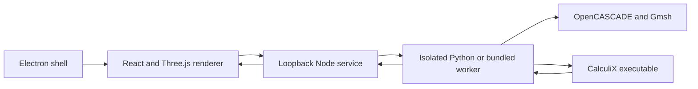

# BetterSim implementation

Version 0.1.0 · 2 October 2026 · implementation baseline: `738bb11`

This document describes the implemented application, its numerical and persistence contracts, and the work needed to extend it. Future work is identified separately from shipped behavior. Interaction research is recorded in [interaction-design.md](docs/interaction-design.md); measured acceptance results are recorded in [validation.md](docs/validation.md).

## 1. Scope and product decisions

BetterSim performs linear static structural analysis of one STEP solid using CalculiX. The current packaged application targets macOS Apple Silicon. Electron, Vite, React, and Three.js provide the desktop shell and interface; Gmsh with OpenCASCADE imports CAD geometry and creates the volume mesh.

The application follows engineering intent: import a part, choose its material, define where it is held, apply loads, inspect the mesh, and examine results. A study tree with the part's face list on the left, the model view in the center, and an inspector on the right keep these dependencies visible. A collapsible console under the view holds job output and solver checks. Light and dark themes follow the system setting until the user picks one. Basic controls use physical descriptions; advanced controls expose material properties, global support directions, and mesh size.

Official SolidWorks documentation informed the workflow decisions before the interface was implemented. BetterSim uses an original layout, styling, assets, and integration code.

Implemented analysis inputs are:

- One solid imported from `.step` or `.stp`, with dimensions and CAD surfaces available for inspection.
- A homogeneous isotropic elastic material, including density and optional yield strength.
- Fixed supports or supports that block selected global X/Y/Z translations on CAD faces.
- A total vector force distributed over selected faces, normal pressure, and gravity.
- Curvature-aware quadratic tetrahedral meshing, with detail presets and an explicit target size.

Results include equivalent stress, displacement magnitude, yield margin, support reactions, force balance, a node probe, and a finer-mesh comparison. All numerical results come from the actual solver pipeline.

## 2. Architecture and source ownership



| Location | Responsibility |
|---|---|
| [src/App.tsx](src/App.tsx) | Application state, job polling, autosave, project save/open, exports, and layout |
| [src/logic.ts](src/logic.ts) | Pure study logic: undo/redo history, draft previews, saved-result validation, yield-margin scale, and material edits |
| [src/Sidebar.tsx](src/Sidebar.tsx), [src/Inspector.tsx](src/Inspector.tsx), [src/Console.tsx](src/Console.tsx), [src/StartScreen.tsx](src/StartScreen.tsx) | Study tree and face list, per-section inspector panels, output/checks console and job progress, and start screen |
| [src/Viewer.tsx](src/Viewer.tsx) | CAD-face rendering, selection and hover, camera controls, condition annotations, mesh display, contours, deformation, and node picking |
| [src/types.ts](src/types.ts) | Renderer domain types, material presets, and initial study values |
| [src/api.ts](src/api.ts) | Local HTTP requests and browser/native file-save bridge |
| [electron/main.cjs](electron/main.cjs) | Window lifecycle, local service startup, packaged engine paths, application menus, and native save dialogs |
| [electron/preload.cjs](electron/preload.cjs) | Minimal bridge for platform information and file saving |
| [server/index.mjs](server/index.mjs) | File intake, document storage, worker execution, job lifecycle, project serialization, and artifact downloads |
| [server/validation.mjs](server/validation.mjs) | Incoming study schema and value validation |
| [engine/worker.py](engine/worker.py) | CAD import, mesh generation, physical setup validation, deck generation, solver execution, and FRD decoding |
| [scripts/bundle-runtime.py](scripts/bundle-runtime.py) | Frozen engine generation and relocation of native solver dependencies |
| [scripts/sign-mac.mjs](scripts/sign-mac.mjs) | Ad-hoc application signing and signature verification |

The study model avoids CalculiX deck syntax. This provides a useful boundary for future solver adapters, but there is no general adapter registry yet: import, meshing, and the CalculiX integration currently live together in `engine/worker.py`.

## 3. Domain and units

| Object | Main fields and meaning |
|---|---|
| Geometry | STEP content hash, bounds, dimensions, volume, recommended element size, preview nodes, and CAD faces |
| Face | CAD entity ID, surface type, area, center, surface anchor, normal, and rendering triangle indices |
| Material | Name, elastic modulus, Poisson ratio, density, and optional yield strength |
| Support | Stable condition ID, name, selected face IDs, and three blocked/free translation flags |
| Load | Stable condition ID, name, kind, selected faces, vector components, and pressure magnitude |
| Study | Material, supports, loads, mesh size, and detail preset |
| Mesh | Nodes, quadratic tetrahedra, CAD face-to-node/triangle mappings, element count, size, and minimum quality |
| Result | Nodal displacement, movement, equivalent stress, extrema, reactions, applied resultant, equilibrium residual, warnings, and solver/mesh metadata |

The interface uses **mm, N, and MPa**. Material density is entered in **kg/m³**, and gravity in **m/s²**. The solver deck uses the consistent **mm–N–tonne–s** system: density is multiplied by `1e-12`, and acceleration by `1000`.

Face selections reference CAD entities rather than rendering triangles or mesh nodes. Face IDs survive remeshing of the same STEP source. They are scoped to that source's SHA-256 hash; selection transfer to a revised CAD file is not implemented.

## 4. Analysis pipeline

### STEP import

The service stores the uploaded STEP in a document directory and launches an import worker. OpenCASCADE converts STEP length units to millimetres. The worker requires exactly one solid with positive volume, creates a triangulated surface preview, and records dimensions, volume, face metadata, and the source hash.

Surface annotations use anchors on the actual CAD surfaces, including curved faces. The initial mesh recommendation is the larger of the smallest part dimension divided by 2.5 and the largest dimension divided by 60. This is a starting heuristic, not a convergence criterion.

### Meshing

Gmsh imports the same STEP source, applies curvature-aware size controls, generates a tetrahedral volume mesh, raises it to second order, and optimizes the curved elements. The worker accepts ten-node tetrahedra and records quadratic surface triangles for load integration and selection mappings.

Minimum signed element quality must be positive. The current limit is 150,000 volume elements; a requested size below one five-hundredth of the longest part dimension is rejected. The element-count limit is checked after generation, so it is not a hard preallocation memory bound.

Coarse, Medium, and Fine use target-size multipliers of 1.5, 1, and 0.65 relative to the recommendation. An explicit size selects Custom. A solve generates its mesh automatically; mesh preview is a separate operation.

### Physical validation

Before writing the deck, the worker validates material values, load values, face references, support directions, and nonzero loading. It constructs the six rigid-body motion modes and checks the rank of the constrained degrees of freedom. An incomplete restraint produces an actionable error. The application does not add artificial springs to conceal instability.

### Deck and load construction

Gmsh connectivity is converted to CalculiX C3D10 ordering by exchanging the final two midside nodes. Deck numbers use bounded significant-digit formatting to avoid fixed-width input problems.

Vector force means **one total force across all selected faces**. Seven-point triangle quadrature integrates the quadratic face shape functions and distributes consistent nodal forces, normalized by the combined loaded area. Selecting another face does not multiply the specified total.

Pressure maps each CAD boundary triangle to the appropriate tetrahedron face and writes CalculiX pressure loads. Positive pressure acts into the solid. Overlapping pressure definitions add. Gravity definitions also add and use the material density.

Equivalent applied nodal contributions are retained for force, pressure, and gravity. They are required when interpreting the solver's nodal force output at supported nodes.

### Solve and result decoding

CalculiX runs as a native subprocess with a 240-second timeout. Solver, assembly, result, and BLAS stages are pinned to one thread because the tested native multithreaded SPOOLES build produced intermittent differences for identical input. Gmsh meshing uses two threads and may produce slightly different meshes between runs.

The worker retains the input deck, mesh, FRD output, DAT output, and solver log. It reads displacement, stress, and nodal force fields from FRD and rejects incomplete displacement or stress results. Equivalent stress is calculated from the averaged nodal stress tensor; movement is the displacement-vector magnitude.

Support reactions subtract equivalent applied loads from the constrained components of CalculiX RF output. The force-balance residual is divided by the larger of the applied resultant magnitude and the sum of equivalent nodal load magnitudes, with a small numerical floor. This handles pressure cases whose resultant cancels around a bore.

## 5. Interface state and result validity

Condition editors use drafts: selecting faces and changing values does not modify the study until Save. Cancel discards the draft. Saved conditions can be named, edited, and removed. The face list exposes surface type, area, and position and highlights the corresponding model surface.

Physical study edits invalidate results. Mesh-size edits invalidate both mesh and results. Camera movement, plot choice, node probing, and deformation display do not change the physical setup. Undo/redo stores up to 30 study edits; undoing a physical edit does not silently resurrect a previously computed result, and keeps the mesh when the element size is unchanged. In the desktop app, Edit > Undo and Redo apply to the focused text field, or otherwise to the study history. Jobs don't block the window: the view stays usable and the inspector is inert until the job finishes or is cancelled.

The viewer provides stress, movement, and yield-margin plots; original, true-scale, and magnified shape display; and an explicit deformation multiplier. Left-drag rotates freely (trackball, no fixed up axis), right-drag pans, and scroll zooms. Perspective is the default; an orthographic projection can be chosen in the view toolbar and is remembered. Resizing the view keeps the camera. Clicking the model probes the nearest rendered result node. Show in view probes the extremum for the active plot; the probed value is labelled in the view. Force balance, reactions, and solver details are in the console's Checks tab. The yield-margin scale runs from 0 to 5 when the part yields and widens (to 10, 20, 50, …) for safer parts, so variation stays visible.

Refinement reduces the current mesh size to 70%, reruns the analysis, and compares maximum movement and peak stress with the previous result. One comparison is evidence of sensitivity, not an automatic convergence certificate. Sharp support edges and corners may produce increasing peak stress.

Exports available in the interface are portable projects, surface-node CSV, viewport PNG, solver input, FRD results, and solver log. The service also exposes the raw mesh.

## 6. Service and worker protocol

The service binds to `127.0.0.1`: port 4318 during normal browser development and an allocated port inside the desktop application. Workers receive a command and document directory as arguments, and study JSON on stdin. Stdout contains the final JSON response; stderr carries progress messages and diagnostics.

| Endpoint | Behavior |
|---|---|
| `GET /api/health` | Report service status, platform, and engine availability |
| `POST /api/import` | Accept multipart STEP data and return document/job IDs |
| `POST /api/sample/:name` | Import the included beam or perforated bracket example |
| `GET /api/jobs/:id` | Poll job status, stage, message, result, or error |
| `DELETE /api/jobs/:id` | Cancel a running job |
| `POST /api/documents/:id/mesh` | Generate a mesh for the submitted study |
| `POST /api/documents/:id/solve` | Mesh and solve the submitted study |
| `POST /api/documents/:id/save` | Serialize the embedded STEP and study |
| `POST /api/open` | Validate and import a portable project |
| `GET`/`POST /api/recovery` | Read or update the autosaved study |
| `POST /api/recovery/open` | Import the autosaved study as a new document |
| `GET /api/documents/:id/export/:file` | Download an allowed analysis artifact |

One mesh/solve job may run per document. On macOS, cancellation and service shutdown terminate worker process groups, including solver children. The renderer tracks operation sequences so an old job's completion cannot clear the busy state of a newer operation. Completed in-memory job records expire after one hour. Document directories are pruned at startup and hourly: the 40 most recently used are kept unless older than seven days, and documents used in the last hour or with a running job are never removed. Errors map to 400 (invalid request), 404 (missing document or artifact), 413 (too large), or 500 (logged, with a generic message).

The service limits STEP uploads to 50 MB, JSON request bodies to 70 MB (enough for a 50 MB STEP encoded in a project), and worker stdout to 100 MB. Electron disables renderer Node integration, enables context isolation and sandboxing, denies permission requests and new windows, and restricts navigation to the application origin. The service validates local hosts and request origins and rejects cross-site requests. These protections do not constitute a completed independent security audit.

## 7. Persistence and recovery

A `.bsim` file is JSON with `format: "bettersim"`, `version: 1`, a display name, base64 STEP bytes, and the study definition. Opening checks the format/version, study schema, STEP header, and file-size limit, then reimports the embedded geometry.

Saving after a solve also embeds the surface mesh and results with the geometry hash and study they belong to. Opening shows them again only when both match exactly; otherwise they are skipped. Solver artifacts are not embedded, so their exports need a new solve.

Autosave keeps one recovery copy, STEP and study, in the service's `recovery/` directory, outside pruning (`GET`/`POST /api/recovery`, `POST /api/recovery/open`). It is a convenience, not a substitute for saving a portable project.

Development document data lives in `.bettersim/`. Packaged desktop document data lives under Electron's user-data directory in `studies/`. Native analysis artifacts remain available there for diagnosis.

## 8. Build and distribution

Development setup and commands are documented in [README.md](README.md). The main commands are:

```sh
npm ci
npm run setup
brew install costerwi/calculix/calculix-ccx
npm run dev:desktop

npm run build
.venv/bin/pip install pyinstaller
npm run package:mac
```

`BETTERSIM_PYTHON` overrides the development worker interpreter, and `BETTERSIM_CCX` selects a solver executable. Browser development uses `npm run dev`; `BETTERSIM_CHROMIUM` overrides the browser executable used by end-to-end tests.

The Mac build freezes Python, Gmsh, and NumPy into a standalone worker. The bundler copies CalculiX and its non-system dynamic dependencies, rewrites library references to adjacent bundled files, and signs the relocated binaries. Electron Builder packages the renderer, service, engine, sample STEP files, offline fonts, and license notices. A final script ad-hoc signs and verifies the application.

Output is `release/mac-arm64/BetterSim.app`. The tested app needs neither Python nor Homebrew on the destination PATH. `npm run dist:mac` additionally requests a DMG. Apple notarization, Intel Mac packaging, and Windows/Linux packaging remain future work.

BetterSim is GPL-3.0-or-later. Dependency notices and public binary corresponding-source requirements are recorded in [THIRD_PARTY_NOTICES.md](THIRD_PARTY_NOTICES.md).

## 9. Acceptance evidence

The recorded baseline passed 18 engine subsystem tests, one local-service acceptance scenario, seven browser scenarios, and a packaged Electron workflow covering the beam and four complex parts. These tests exercise real Gmsh and CalculiX execution.

| Test source | Coverage |
|---|---|
| [tests/test_engine.py](tests/test_engine.py) | Analytical bending/extension, units, face identity, supports, forces, pressures, gravity, invalid input, refinement, and nine repeated fixed-mesh solves |
| [tests/test_complex_parts.py](tests/test_complex_parts.py) | Independent STEP exporter checks, curved geometry, quadratic mesh quality, equilibrium, load scaling, refinement, and curved pressure references |
| [tests/server.test.mjs](tests/server.test.mjs) | Import, portable save/open, solve, exports, request/project validation, recovery, error statuses, size limits, and pruning |
| [tests/logic.test.ts](tests/logic.test.ts) | Undo history invariants and the guard against showing saved results for a different study |
| [tests/e2e.spec.ts](tests/e2e.spec.ts) | Full study setup, probing, refinement, project reopening, invalidation, undo, malformed import, complex parts, and toroidal pressure reactions |
| [tests/desktop.mjs](tests/desktop.mjs) | Packaged app with restricted PATH, bundled engine/solver, complex imports, solves, contours, and peak probes |

The complex fixtures are a bearing block with fillets and counterbores, a gusseted bracket, a pocketed housing with intersecting bores, and a toroidal elbow with end collars. They contain 10–35 CAD faces. Recorded refined meshes contain up to about 56,000 quadratic elements, with maximum movement changes below 0.5% for these setups. Peak stress on the bracket changes by about 20%, so peak stress convergence is not claimed.

CadQuery generates these fixtures through a separate STEP exporter, although both exporters/importers use OpenCASCADE. Committed STEP files allow normal tests to run without installing CadQuery. Exact measurements and numerical tolerances are in [validation.md](docs/validation.md) and [complex-validation.json](docs/complex-validation.json).

```sh
npm run test:engine
npm test
npm run test:e2e
npm run test:all
npm run test:desktop
```

The evidence does not yet include physical correlation, an independent commercial solver comparison, or a representative customer CAD corpus. Automated browser and packaged desktop checks passed; a separate manual native click-through was unavailable because the Mac was locked.

## 10. Remaining implementation work

The following is a proposed extension sequence, not functionality shipped in 0.1:

1. **Strengthen the single-part release.** Expand external CAD fixtures and numerical references; add resource budgeting before meshing, richer mesh-quality guidance, and independent solver/physical comparisons. Complete signing/notarization and public binary source distribution. Add platform-specific packaging and acceptance runs for Intel Mac, Windows, and Linux.
2. **Separate application and solver boundaries.** Introduce explicit job/result schemas, project migrations, and a solver adapter contract around validation, deck generation, execution, and decoding. Preserve the current end-to-end tests through the refactor.
3. **Introduce assemblies deliberately.** Model bodies, instances, transforms, materials per body, and selections scoped by body identity. Define bonded/contact interactions and connectivity checks before exposing assembly controls. Add fixtures for disconnected bodies and invalid interactions.
4. **Add analysis-specific models.** Thermal requires temperatures, heat inputs, and thermal materials; frequency requires eigenmodes and modal result display; buckling requires a reference load state and eigenvalue interpretation. Nonlinear and dynamic analysis require increments/time histories, solver controls, and result sequences. Fatigue requires an explicit method and validated material/load-cycle data.
5. **Handle CAD revisions.** Introduce topology matching with confidence and unresolved-selection review. Never reuse a face number from changed geometry without verifying its meaning.

Extensions should retain the product contract: understandable physical inputs, explicit assumptions and units, inspectable native solver artifacts, honest result validity, and subsystem/end-to-end acceptance evidence.
