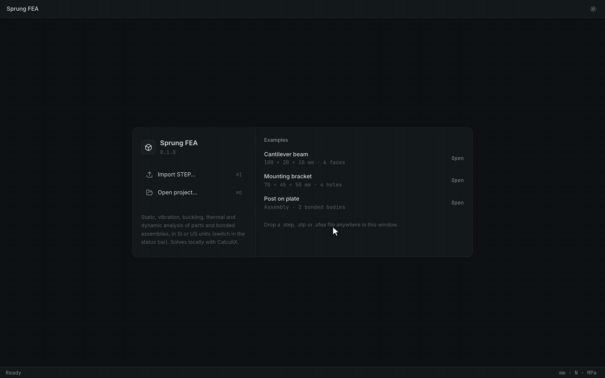
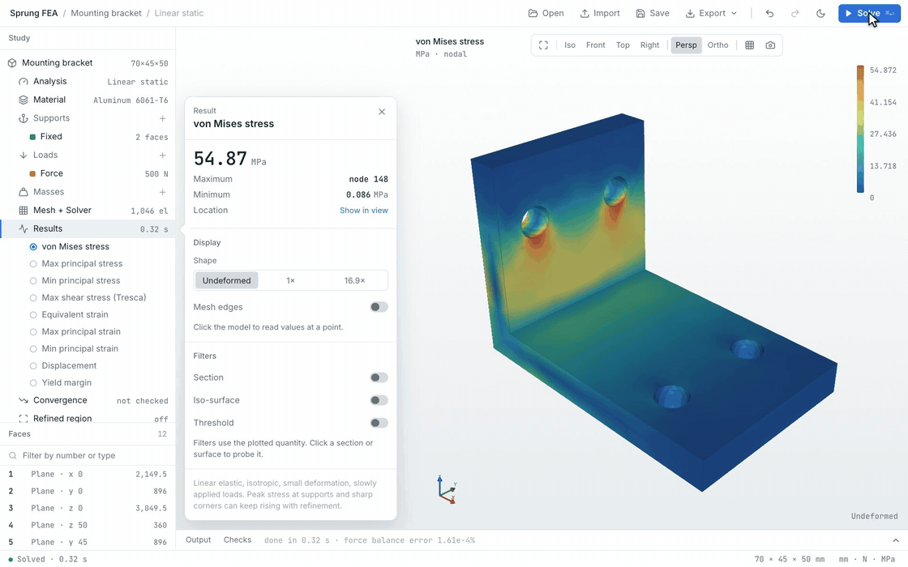
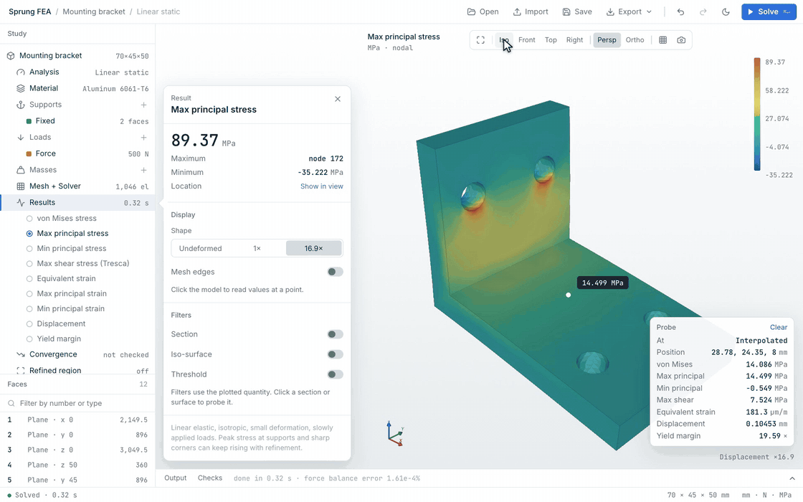
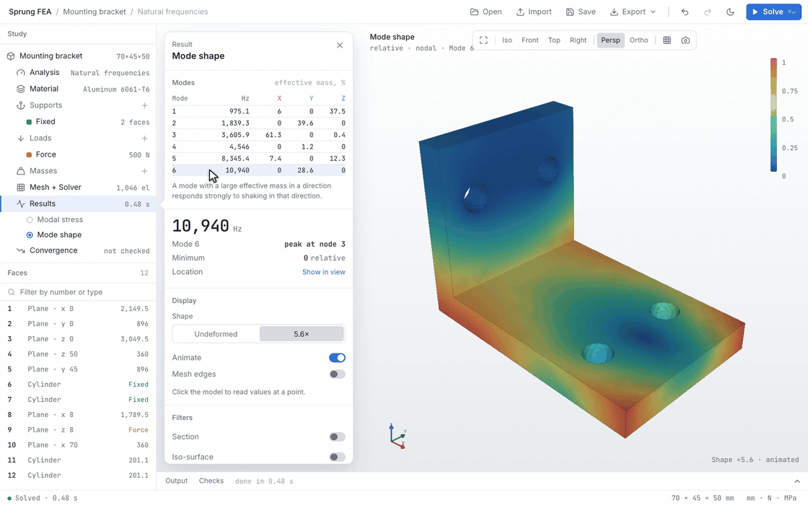

# Sprung FEA

Stress, vibration and heat analysis for mechanical parts, on your own computer.

Open a STEP file, pick a material, click the faces that hold the part and the faces that carry load, and solve. Sprung FEA meshes the geometry, runs the open-source CalculiX solver locally, and shows you where the part is stressed, how far it moves, how it vibrates and how hot it gets.

It runs on macOS, Windows and Linux. Its source code is free software (GPL-3.0-or-later). The downloadable builds also include separately licensed components (see [License](#license)).

*Setting up a wall-mounted bracket: material, supports, load, solve.*

## What it can analyze

| Analysis | What you learn |
|---|---|
| **Linear static** | Stress, strain and deflection under steady loads, and how much margin you have to yield. Optional large deformation for thin, flexible parts and plasticity for loads past yield. |
| **Natural frequencies** | The frequencies the part vibrates at on its own, with an animated shape for each mode and how much mass moves in each direction. Loads can be included, so tension or spin stiffens the part. |
| **Buckling** | How many times the loads can grow before a slender or thin-walled part buckles, and the shape it buckles into. |
| **Heat transfer** | The temperatures the part settles at, or how they change over time, with fixed temperatures, heat input, heat generated inside the part, convection to air or liquid, and radiation. |
| **Thermal stress** | The stress and deflection caused by thermal expansion pushing against the supports, together with any mechanical loads. |
| **Harmonic response** | How much the part vibrates when loads or its mounting shake it across a range of frequencies: where the resonances are and the stress they cause. |

Parts can be a single solid or an assembly. If a STEP file has several bodies, they are bonded where their faces touch, and each body can have its own material. In a static study you can turn on **Contact and bolts**: touching bodies can then separate and slide (frictional or frictionless), and bolts are tightened to a preload before the loads act. Results show each bolt's force and the force, state and pressure of each contact. The **Bolted joint** example on the start screen is set up this way.

## Looking at results

Click anywhere on the part to read the values at that point. Switch between von Mises stress, principal stresses, maximum shear, strain, displacement and yield margin from the study tree. Deflection can be shown true-scale or magnified, and the magnification is always labeled. Filters let you cut the part with a section plane, draw an iso-surface, or show only the region above a stress limit. The section plane also reports the force, bending moment and torque carried through the cut, for sizing bolts, welds or a cross-section.

Changing the analysis type keeps your material, supports and mesh. Here the same bracket finds six modes from 975 Hz to 10.9 kHz, and each one animates when you select it in the table.

## Install

Find the latest release here: [Releases](https://github.com/kylebme/sprung-fea/releases)

| Platform | Download | Installation |
| --- | --- | --- |
| macOS, Apple Silicon | `Sprung-FEA-x.x.x-arm64.dmg` | Open the DMG and drag Sprung FEA to Applications. |
| Windows, x64 | `Sprung-FEA-Setup-x.x.x.exe` | Run the installer; it installs for your user without administrator rights. |
| Linux, x64 | `Sprung-FEA-x.x.x-x86_64.AppImage` | Make it executable with `chmod +x Sprung-FEA-0.2.1-x86_64.AppImage`, then run it. |

These builds are unsigned (macOS is ad-hoc signed, without notarization). On macOS, use **System Settings → Privacy & Security → Open Anyway** after the first launch is blocked. On Windows, use **More info → Run anyway** if SmartScreen appears.

Everything the app needs, including the solver, is bundled. Nothing is uploaded anywhere: meshing and solving happen on your machine.

## Your first study

The **Examples** on the start screen (a cantilever beam, the mounting bracket from the clips above, and a two-body assembly) are a good place to start. Each has a **Use example setup** button that fills in a working study.

1. **Import a part.** Use **Import STEP…** or drop a `.step` / `.stp` file onto the window. Check the size shown in the inspector against your CAD model: STEP units are converted to millimetres on import.
2. **Choose the analysis.** Linear static is the default. Pick another under **Analysis** in the study tree.
3. **Set the material.** Choose a preset (aluminum 6061-T6, structural steel, stainless 304, titanium Ti-6Al-4V) or type in the values from your material's datasheet. The presets are typical values, not a specification.
4. **Add supports.** Click faces in the 3D view or the face list. In an assembly the face list is grouped by body: hide a body, isolate it, or take all its faces at once, and right-click a face in the view for the same choices. Faces being picked show through the bodies in front of them, and each condition's name is pinned where it acts. When adding a bolt, the bolts found in the part are offered. **Fixed** holds a face completely; **Directional** blocks only the X, Y or Z directions you choose; **Frictionless** lets a face slide along itself, at any angle; **Cylindrical** holds a hole or shaft radially, around or along its axis, like a pin. The study needs enough support to stop the part from sliding or spinning freely, and Sprung FEA tells you if it doesn't.
5. **Add loads.**
   - **Force** is one total force shared across all the selected faces.
   - **Pressure** acts normal to the faces; positive pushes inward.
   - **Gravity** uses the material's density.
   - **Remote force** acts at a point away from the faces, so an offset adds a moment.
   - **Moment** twists the selected faces.
   - **Bearing** presses a pin or shaft against the loaded half of a hole.
   - **Rotation** spins the part about an axis (rpm).
6. **Add masses** (optional). A point mass stands in for something you are not modeling, such as a motor: give its mass, where its center of mass is, and the faces it is bolted to.
7. **Solve.** Click **Solve** or press ⌘↵ (Ctrl+Enter). The part is meshed automatically. **Medium** mesh is a sensible start; **Preview mesh** shows the elements before you commit.

Any change to the study clears the old results, so what you see always matches the setup.

## Checking your answer

A finite element result depends on the mesh, the supports and the material data you gave it. Sprung FEA has a few tools to help you decide whether to trust a number.

- **Mesh convergence** re-solves on finer and finer meshes until displacement and peak stress stop changing, and charts the result. It warns you when peak stress keeps rising at a sharp corner, which usually means the peak is a modeling artifact rather than a real value.
- **Refine a region** re-solves a box around a hot spot on a much finer mesh, driven by the whole-part solution at its edges, and reports how well the two agree.
- The **Checks** tab under the view shows support reactions, force balance and solver diagnostics.
- Yield is flagged, and so is movement large enough to make a small-deflection analysis questionable.

## Units

Work in SI (mm, N, MPa, °C) or US customary (in, lbf, psi, °F). Switch at any time from the units display in the bottom-right corner of the status bar. Values are stored in SI either way, so switching never changes the model.

## Saving and sharing

- **Save** (⌘S) writes a `.sfea` project containing the geometry, the setup and the latest results. It opens on any machine with Sprung FEA, without the original STEP file.
- The app autosaves as you work. If it closes unexpectedly, your last study is on the start screen under **Recent**.
- Undo and redo (⌘Z, ⇧⌘Z) cover every change to the study.
- **Export** gives you surface node values as CSV, the current view as PNG, and the CalculiX input deck, results file and solver log for checking the run elsewhere.

On Windows and Linux, use Ctrl in place of ⌘.

## Limits

Sprung FEA 0.2 uses ten-node tetrahedral solid elements and assumes:

- Isotropic materials. Plasticity, when turned on, follows a straight line from yield to ultimate strength, or the stress–strain points you enter. Heat transfer and thermal stress can use properties that change with temperature.
- Slowly applied loads.
- Small deflections unless **Large deformation** is on.
- Bodies in an assembly are bonded unless contact is turned on. Contact works between faces that touch in the CAD model, not across gaps.

It does not do shells or beams, fatigue, or transient dynamics. Stresses right at sharp internal corners and at the edges of supports are often higher than the real part would see. Use the convergence study, and judge those spots with care.

## Building from source

Development setup, packaging, tests and the internals are in [IMPLEMENTATION.md](IMPLEMENTATION.md). Measured validation results are in [docs/validation.md](docs/validation.md).

## License

The Sprung FEA source code is GPL-3.0-or-later (see [LICENSE](LICENSE)), except the small `sprung-solve` program in `native/sprung-solve`, which is MIT.

The prebuilt downloads include separately licensed third-party components, each under its own license:
- CalculiX, the solver, is GPL-2.0-only and runs as a separate program.
- The Windows and Linux builds include Intel oneMKL, a proprietary library under the Intel Simplified Software License. It sits inside `sprung-solve`, a separate program that runs the fast PARDISO solver for CalculiX.

All components, their licenses and how they fit together are listed in [THIRD_PARTY_NOTICES.md](THIRD_PARTY_NOTICES.md), and the license texts ship with the app.
